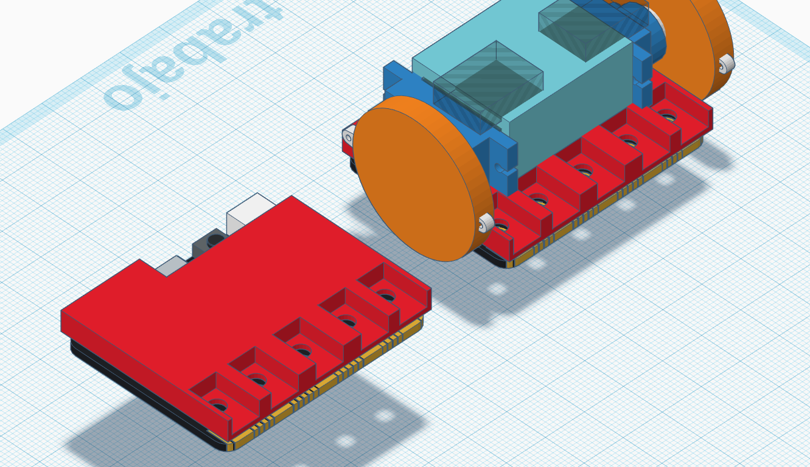

# Small micro:bit Robot: WallBot

Se trata de un robot minimalista creado por [@google_homer_](https://twitter.com/google_homer_) [aquí](https://twitter.com/google_homer_/status/1178613025651089409)

Capaz de subir por una pizarra metálica en la pared o [techo](https://twitter.com/google_homer_/status/1178256467272466432)

## Estructura

Utiliza una pieza de plástico

[Diseño de pieza similar](https://www.tinkercad.com/things/c2KHwhFIUlu)

## Mejora/ampliación: sensor de ultrasonidos
Añadimos un [sensor de ultrasonidos de 3 pines](https://www.elecfreaks.com/estore/sonar-bit-for-micro-bit-ultrasonic-sensor-distance-measuring-3v-5v.html)

[Programa](https://makecode.microbit.org/_RW0VecFL0dJw)

## Haciendo equilibrios

### V0 Sólo usando tiempos
[Equilibrios](https://twitter.com/google_homer_/status/1178930713921376258)

### V1 Usando el acelerómetro
